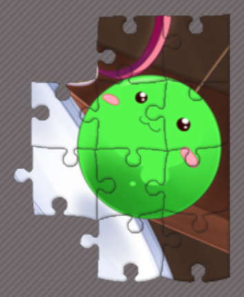
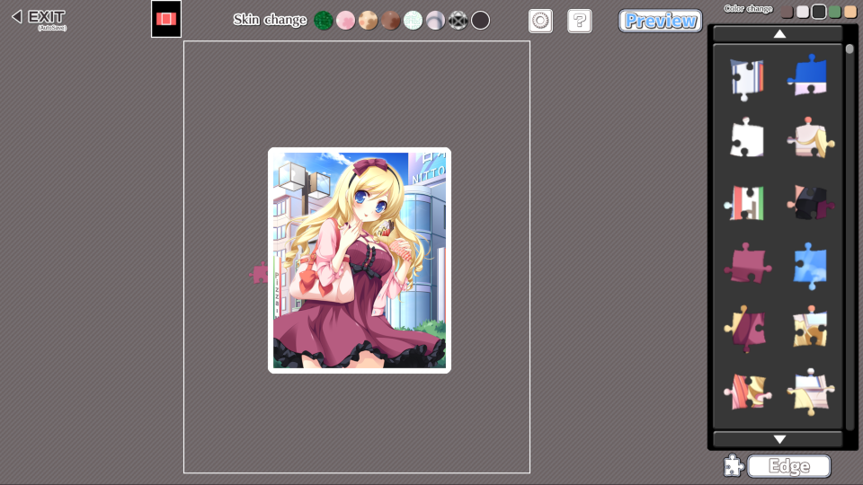
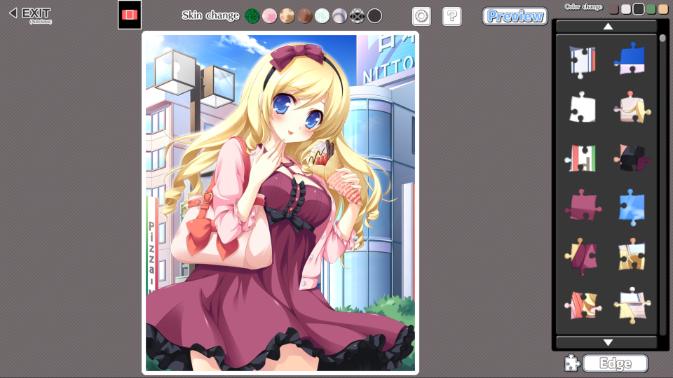
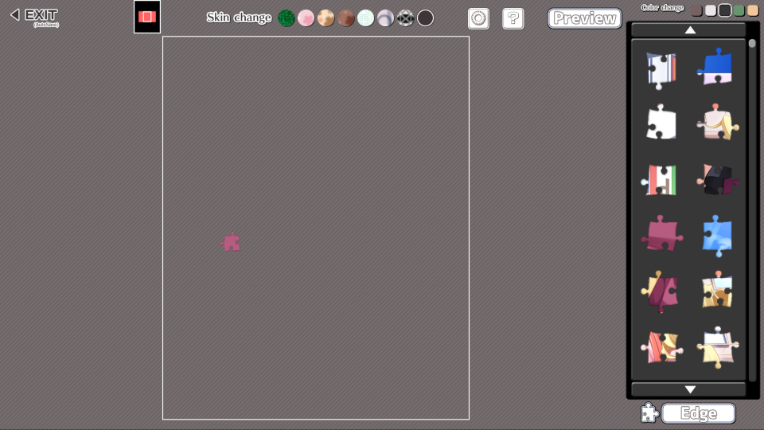
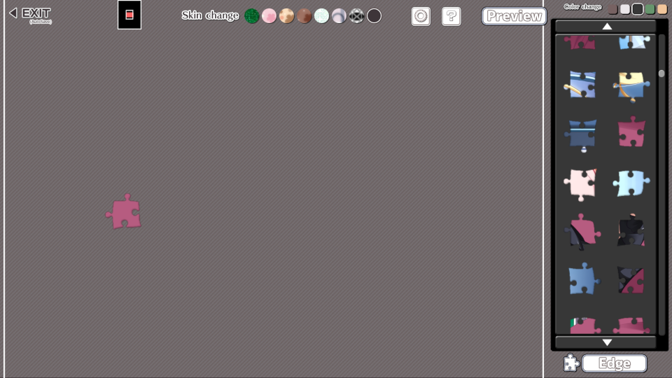

Unofficial quality of life modifications for the hit video game Moe Jigsaw using MelonLoader.

# Disclaimers
- These mods are unofficial and are not associated with, related to, and/or endorsed by ARES inc.
- USE AT YOUR OWN RISK. NO WARRANTIES.
- Please read [FAQ](#frequently-asked-questions).

# Mod list
The following mods are currently available:
- [Appearance memory](#appearance-memory) — actually saves the background/tray settings
- [Crisper images](#crisper-images) — uses higher resolution images for the puzzle and its preview
- [Deeper zoom](#deeper-zoom) — customizable zoom levels for the puzzle and preview image
- [Pan anywhere](#pan-anywhere) — enables panning on mouse wheel clicks
- [Piece freeze](#piece-freeze) — allows to lock parts of the puzzle from accidental changes

These mods are all compatible with each other, and can be used in any combination.

## Appearance memory
This mod fixes the selection of the background image and the tray color not being saved between puzzles:

Vanilla:

https://github.com/user-attachments/assets/79c161c2-6a2b-44cb-b621-22235e868a8e

Appearance memory:

https://github.com/user-attachments/assets/03f0ba99-a9c5-45c1-b633-8be8632e0f08

The settings are saved using MelonLoader's preferences framework, inside the default `UserData/MelonPreferences.cfg` file.
Running the game with the mod installed should create the following section in the file:
```toml
[Bnfour_AppearanceMemory]
# Index of the background image to use, 1–8.
Skin = 1
# Index of the tray color to use, 1–5.
Tray = 1
```

`Skin` can be set to values 1 through 8; `Tray` can be set to 1 through 5 — matching the in-game display order, left to right:  


## Crisper images
This mod switches main in-game images to their higher resolution versions.

Puzzle image now uses the texture originally used in Gallery mode; puzzle preview now uses the texture originally used for the puzzle itself:
| Image | Before | After |
| :---: | :---: | :---: |
| Puzzle<br/>(2× zoom via Deeper zoom) |  |  |
| Preview<br/>(maximum zoom level) |  |  |

## Deeper zoom
This mod enables custom zoom levels for the puzzle and preview image, especially useful for taller (height > width) puzzles. The number of steps between minimum and maximum zoom levels can be adjusted as well.

Compare these images taken at maximum zoom:

| Vanilla (yes, this is the maximum zoom) | Deeper zoom's default config, 2× as deep |
| :---: | :---: |
|  |  |

### Configuration
The zoom values can be adjusted via mod's preferences. Launching the game with the mod installed should create the following section in MelonLoader's default preferences file, `UserData/MelonPreferences.cfg`:
```toml
[Bnfour_DeeperZoom]
# Maximum zoom value for the puzzle. 1–10 (float), vanilla default is 1.
MaxScale = 2.0
# Number of zoom level between minimum and maximum. Inclusive, so can't be less than 2 (max value is 64).
ZoomSteps = 11
# Maximum zoom value for the preview image. 2–50 (int), vanilla default is 10 (1x). Measured in 10% increments of original texture size.
PreviewZoomMax = 10
# Minimum zoom value for the preview image. 1–49 (int), vanilla default is 4 (0.4x). Should be less than maximum value.
PreviewZoomMin = 4
```

By default, preview image's zoom is unchanged. Adjust if necessary.
Please note that some validation is in place:
- `MaxScale` cannot be lower than 1.0, the vanilla value  
(it also cannot be higher than 10.0, but why would you need _that_ much zoom?)
- `ZoomSteps` cannot be lower than 2 to at least allow switching between minimum and maximum possible scales  
(64 is a completely arbitrary upper limit)
- Both `PreviewZoomMax` and `PreviewZoomMin` are measured in 10% parts of the original image's size  
(1 is 10% of original size, 5 is 50%, 10 is original size, you get the idea)
- `PreviewZoomMax` cannot be lower than 2 to at least allow two zoom levels  
(and higher than 50 (5× the original size; not that you'll need it))
- `PreviewZoomMin` cannot be lower than 1; it is also forced to be less than `PreviewZoomMax`  
(so yep, no higher than 49)

## Pan anywhere
This small mod enables dedicated pan mode when the mouse wheel is held, regardless of anything that might be under the cursor.

Can be done while dragging a piece!

This also probably breaks the input replay feature (that I've never encountered, might be debug-only?).

## Piece freeze
This mod allows to lock pieces in place to prevent accidental interactions. Locked pieces will flash red on attempts to move or rotate them:


Click a piece while holding <kbd>Alt</kbd> (either one works) to toggle the lock state for it and all the other pieces connected to it. Red flash indicates that the piece was locked, green flash indicates unlock.

Any pieces newly attached to a locked group will become locked too:


The freeze state per puzzle is stored in `MoeJigsaw_Data/pieces.frz` file (only present when there is data to store). It's a very simple plaintext file, but I don't recommend editing it by hand. If the mod can't load the file for some reason it may or may not provide as an error in the MelonLoader's logs, it will overwrite it on clean game exit.

>[!TIP]
>In case of issues with the lock feature, delete the save file.

### Configuration
It's possible to disable the sound effects that this mod introduced by default — some vanilla sounds are reused for pieces (un)locking and showing their locked state.

The mod's preferences are stored in MelonLoader's default preferences file, `UserData/MelonPreferences.cfg`. Launching the game with the mod installed should create the following section in the file:
```toml
[Bnfour_PieceFreeze]
# Play sounds on pieces (un)locking.
Sounds = true
```

Set the value to `false` to disable the custom sounds.

# Installation
These are [MelonLoader](https://melonwiki.xyz/) mods. In order to run these, you need to have it installed. Currently, 0.7.1 Open-Beta of MelonLoader is supported.
Once you have MelonLoader installed, drop the DLLs of desired mods into the Mods folder. Remove to uninstall.

Rather than downloading these, I suggest (reviewing the source and) building them yourself — this way you'll be sure the mods behave as described. See ["Building from source"](#building-from-source).
Otherwise, please verify the downloads.

## Verification
Every published release is accompanied with SHA256 hashes of every DLL. MelonLoader does print these in console when loading mods, but I suggest to verify the hashes before installation.

# Frequently Asked Questions
_(or, more accurately, "I thought you may want to know this")_

### Is this cheating?
_tl;dr: no_

All the mods add convenience fixes/features to the gameplay. There are no features (nor any plans to implement them) to do more questionable stuff like achievements unlock.

Unless you consider any third-party modification of the game as cheating, this is not it.

### Will I get banned for using these?
_tl;dr: no_

The game is completely singleplayer — why would anyone care about what someone does in (or with) it?

### What about compatibility with other mods?
<!-- surely they exist Clueless -->
_tl;dr: no idea_

Some of the mods use a bit of transpilation, so they might break if other mods transpile the same methods.

### How can I blame you if this breaks my game?
_tl;dr: no warranties, use at your own risk_

You can always uninstall the mods (and optionally the loader).

Before opening an issue, please check that:
- you're using supported version of MelonLoader (0.7.1)
- the issue is caused by one of the mods and goes away when the mod is uninstalled
- vanilla game is not broken too
- the issue is not already reported

# Building from source
This repo is mostly a regular .NET solution. It just targets 32-bit .NET Framework 3.5 in the current year to be compatible with the game. (.NET Framework 3.5 was released in 2007.)

Another thing to note is some referenced libraries are not included because of file size (and licensing, mostly) issues. Your installation of MelonLoader will generate them for you.

Copy everything from `MelonLoader/net35` and `MoeJigsaw_Data/Managed` folders from the game install to the `references` folder of this repo. All the DLLs should be directly into it, no subfolders.

This should cover the local references for all the projects. (Actually, most of the DLLs are not necessary to build the solution, I just don't plan on keeping an accurate and up to date list of required libraries.)

After that, just run `dotnet build`.
