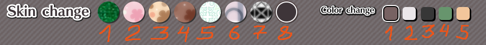

Unofficial quality of life modifications for the hit video game Moe Jigsaw using MelonLoader.

# Disclaimers
- These mods are unofficial and are not associated with, related to, and/or endorsed by ARES inc.
- USE AT YOUR OWN RISK. NO WARRANTIES.
- Please read [FAQ](#frequently-asked-questions).

# Mod list
The following mods are currently available:
- [Appearance memory](#appearance-memory) — actually saves the background/tray settings
- [Crisper images](#crisper-images) — uses higher resolution images for the puzzle and its preview

<!-- These mods are all compatible with each other, and can be used in any combination. -->

## Appearance memory
This mod fixes not saving the selection of the background image and the tray color between puzzle screens:

before video

after video

The settings are saved using MelonLoader's preferences framework, inside the default `UserData/MelonPreferences.cfg` file.
Running the game with the mod installed should create the following section in the file:
```toml
[Bnfour_AppearanceMemory]
# Index of the background image to use, 1–8.
Skin = 1
# Index of the tray color to use, 1–5.
Tray = 1
```

`Skin` can be set to values 1 through 8; `Tray` can be set to 1 through 5 — matching the in-game display order, left to right:
<!-- TODO is it needed though? -->


## Crisper images
This mod switches main in-game images to their higher resolution versions.

Puzzle image now uses the texture originally used in Gallery mode; puzzle preview now uses the texture originally used for the puzzle itself:
| Image | Before | After |
| --- | --- | --- |
| Puzzle | TODO | TODO |
| Preview | TODO | TODO |

TODO optional explanation for the three image sizes?

# Installation
just copypaste LULE

## Verification
ditto

# Frequently Asked Questions
the same "questions"?

# Building from source
just notice it targets really old stuff; net 3.5 was released in 2007 Aware
